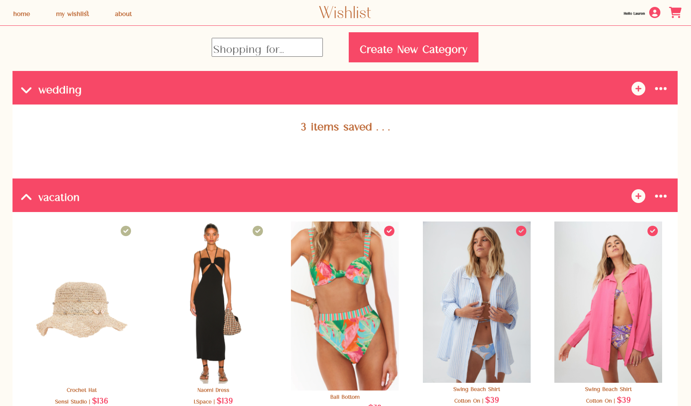

# :dress: Wishlist  :sandal:
MERN Fullstack Application.

Check out the [live site!](https://laurencolvin.github.io/wishlist-client/#/)   
[Deployed Backend Link](https://obscure-eyrie-60165.herokuapp.com/)   
[Github Repository for Backend](https://github.com/LaurenColvin/wishlist-api)

## Project Description

Wishlist is an online shopping app to help you plan your purchases. So much better than having a million tabs open and carts filled with items you can’t remember at 20 different stores. Put all of your ideal items in one place to better plan and save up for your dream wardrobe! This app will also help with budgeting and making sure you are making the best purchase at the best price.


This app includes a backend database using MongoDB and Express.js and a frontend web application using Node.js and React.



## Project Schedule

| Day   | Deliverable                          | Status     |
| ----- | ------------------------------------ | ---------- |
| Day 1 | Planning and Approval                | Complete   |
| Day 1 | Set up backend files and structure   | Complete   |
| Day 2 | Test and deploy backend              | Complete   |
| Day 2 | Set up frontend files and structure  | Complete   |
| Day 3 | Add algorithm sorting method         | Complete   |
| Day 4 | CSS Styling and Responsive Design    | Complete   |
| Day 5 | MVP & Bug Fixes & Adding Seed Data   | Complete  |
| Day 6 | Final Touches and deploying frontend | Complete   |
| Day 7 | Present                              | Complete |


## User Stories

Wishlist is for all avid shoppers who love to plan out outfits for every big event and occasion. They are constantly looking for the next best dress, shoe or coat but can't decided when to actually pull the trigger. They are left making impulse purchases that don't actually live up to what they wanted. Our user needs a better way to shop and keep track of all the best items on the market!

Wishlist will be the first thing they open before starting the hunt. As they visit sites and find something they like, they will add a link, photo and price to Wishlist with a quick form. Soon their wishlist will be full of amazing ideas and they can compare by price and style across all of their favorite brands. When they think they have made a decision they can add the item to their cart and checkout their budget to make sure they have enough spend for the month to buy their dream items!

Finally once the purchase has been made their new item will be added to their wardrobe and the rest of the items will get pushed to an archive, incase they want to add it back to a wishlist for another occasion. Shop smarter, not harder.

## Wireframes

- [Mobile](https://drive.google.com/file/d/1dCeo_mIjLAYyyYHV_93LgRJ0D0fYvI7I/view?usp=sharing)
- [Desktop](https://drive.google.com/file/d/1hPq69KIWkQP0rKx7H7kZRMSp_uDjQ5kz/view?usp=sharing)


### MVP/PostMVP

#### MVP

- 2 models for data (User, Item)
- CRUD functionality (Add User, Add Item, View Items, Edit Item/User, Delete Item/User)
- Have 4 Routes and multiple components on frontend (Home, Wishlist Page, My Wardrobe, Cart, About)
- Fetch data from backend API
- Responsive design from mobile to desktop
- Add sorting algorithm for items
- Fully Deployed frontend and backend

#### PostMVP

- Add budgeting and total closet worth features
- Use Gestalt UI/UX library
- Login authentication
- Add suggestions for trending styles


## Time/Priority Matrix

[Link](https://drive.google.com/file/d/1KQG9TzShYeTfTY-nrRmMcrmf_DIRg5dd/view?usp=sharing)

#### MVP

| Component                          | Priority | Estimated Time | Actual Time |
| ---------------------------------- | :------: | :------------: | :---------: |
| Installing and Setup for backend   |    H     |      1hr       |     1hr     |
| Models and Schemas                 |    H     |      2hr       |     2hr     |
| CRUD Routes and testing on Postman |    H     |      3hr       |     3hr     |
| Deploying backend                  |    H     |     1.5hr      |     1hr     |
| Creating React App                 |    H     |      1hr       |     1hr     |
| Add Routes                         |    H     |      1hrs      |    1hr    |
| Create Components                  |    H     |      6hrs      |     12hr     |
| Fetch and test data on frontend    |    H     |      3hr       |     3hr     |
| Add Sorting Algorithm             |    H     |      5hr       |     2hr     |
| Responsive Design                  |    H     |      6hr       |     6hr     |
| CSS and Bootstrap                  |    L     |      4hr       |     4hr     |
| Deploy frontend                    |    L     |      1hr       |     1hr     |
| Total                              |    H     |    40.5hrs     |   39hrs   |

#### PostMVP

| Component                          | Priority | Estimated Time | Actual Time |
| ---------------------------------- | :------: | :------------: | :---------: |
| Budgeting and Total Closet Worth   |    L     |      1hr       |     1hr      |
| Add Gestalt UI/UX library           |    L     |      3hr       |     hr      |
| Suggestion Page                    |    M     |      4hr       |     hr      |
| Login Authentication               |    H     |      4hr       |     2hr      |
| Animations                         |    H     |      4hr       |     2hr     |
| Total                              |    H     |     16hrs      |    5hrs     |


## Models

```js

User = {
    firstName: String,
    lastName: String,
    email: String,
    budget: Number,
    categories: [],
    wishlistItems: [],
    cartItems : [],
    wardrobeItems : [],
    archiveItems : [],
}

Item = {
    category: String,
    title : String,
    brand: String,
    price : Number,
    size: String,
    color: String,
    link : String,
    imgUrl : String

```

## Routing Table

| **URL**       | **HTTP Verb** | **Action** | **Description**             |
| ------------- | ------------- | ---------- | --------------------------- |
| /user          | POST          | create     | add new user                |
| /item          | POST          | create     | add item              |
| /user       | GET           | show       | show all users|
| /user/:id   | GET           | show       | show one user data |
| /item     | GET           | show       | show all items |
| /item/:id | PUT           | update     | update item details           |
| /user/:id   | PUT           | update     | edit user                |
| /user/:id   | DELETE        | delete     | delete user           |
| /item/:id | DELETE        | delete     | delete an item      |

## Functional Components

[Diagram](https://drive.google.com/file/d/17cGjAESupnZ7Q0qaaunMyn2rSg3j8hVc/view?usp=sharing)

| Component               |                  Description                  |
| ----------------------- | :-------------------------------------------: |
| Home                    |     Landing Page with how to use the site     |
| Login                    |     Login Modal with form to create user     |
| My Wishlist          |           Form for adding a wishlist category and items           |
| Category Items           |    Individual category sections with items     |
| Item Cards                    |     Each item card with add to cart function    |
| Add Items                    |     Add Item modal with form for new items     |
| User Page         |    Include all purchased items you now own     |
| Cart |         Add items to your cart to compare with your budget         |
| About             |          Photos and description of website          |
| Header                  |                 Logo and Menu                 |
| Footer                  |       Copyright tag and link to github        |


## Additional Libraries

[Font Awesome Icons](https://fontawesome.com/)

## Code Snippet

Here is my function that adds or removes an item from the cart. First it checks if the item was already in the cart before determining which to do.

```js
const putItemCart = (item) => {
        let check = props.cartItems.filter((n) => n._id === props.item._id);
        let itemsCopy = []
        if (check.length >= 1) {
            itemsCopy = props.cartItems.filter((n) => n._id != props.item._id);
            setCartRemove(true)
            setTimeout(function() {
                setCartRemove(false);
                }, 1000);
        } else {
            itemsCopy = [...props.cartItems];
            itemsCopy.push(item);
            setCartSuccess(true)
            setTimeout(function() {
                setCartSuccess(false);
                }, 1000);
        }
}
```

## Issues and Resolutions

**ERROR**:
I wanted to implement an alert for "added to cart". Needed it to disappear after a few seconds and show up onClick.

**RESOLUTION**:
Discovered the setTimeout() function so the alert would disappear after a set amount of time.